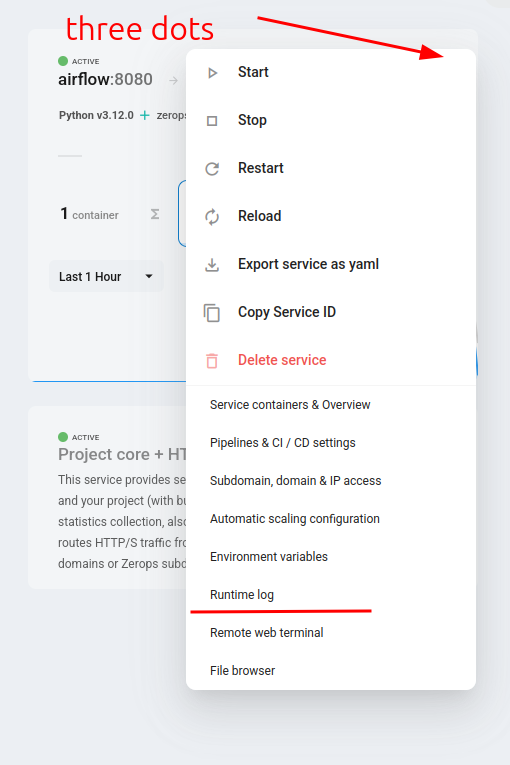
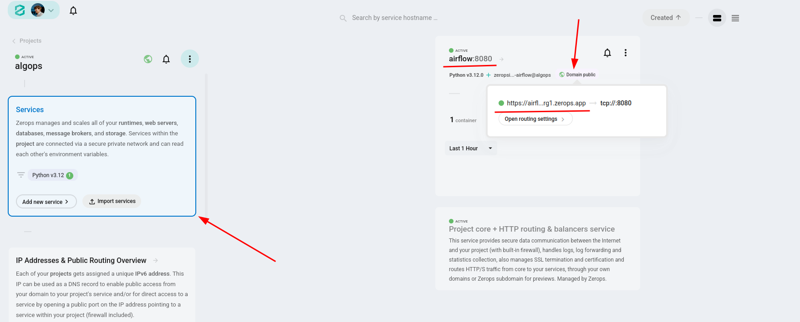

# Zerops x Algops x Apache Airflow

## Development (Standalone)

Standalone mode ([docs](https://airflow.apache.org/docs/apache-airflow/stable/start.html)), not recommended for production usage.

### Setup Steps
1. Git clone this repository
```shell
git clone -b algops https://github.com/zeropsio/recipe-airflow.git
cd recipe-airflow
```

2. Install zCLI and login to your Zerops account (see https://docs.zerops.io/references/cli)

3. Import the contents of [zerops-import.yml](zerops-import.yml) to desired project (either create a new one for free or add it to n8n)
```shell
# Make sure to select correct project.
zcli project service-import zerops-import.yml
```
Or import the following YAML via GUI:
```yaml
services:
  - hostname: airflow
    type: python@3.12
    verticalAutoscaling:
      minRam: 1
    maxContainers: 1
    buildFromGit: https://github.com/zeropsio/recipe-airflow@algops
    enableSubdomainAccess: true
```
Now, the Airflow instance should be creating.

4. Access details can be found in runtime log, look for logs as the following:
```text
standalone | Airflow is ready
standalone | Login with username: admin  password: *****
standalone | Airflow Standalone is for development purposes only. Do not use this in production!
```



5. Copy the password and visit subdomain URL



You should be able to login and use Airflow!

### DAGS Development
1. Activate zCLI VPN to securely access the Airflow instance (see https://docs.zerops.io/references/vpn)
```shell
zcli vpn up
```

2. Make changes in `dags/` and push your DAGS to the instance via rsync
```shell
rsync -ar --progress --delete ./dags/ airflow.zerops:/var/www/dags/
```
Now, your local dags should be registered by Airflow scheduler instance.

### Notes
If you need extra python packages or otherwise change you Airflow instance, simply update [zerops.yml](zerops.yml) and run `zcli push airflow`.
This will create new Airflow instance with given packages installed (you may need to check for password again in the runtime logs though). 